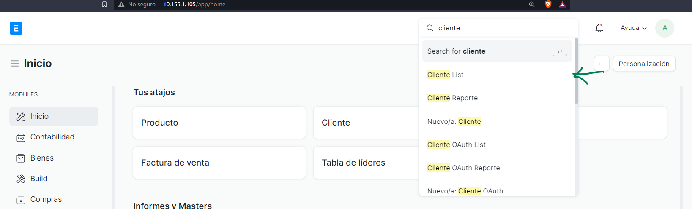

# Configuración de clientes y proveedores

En la ruta `/app/customer` o si ingresas en la barra de búsqueda:

Crea un nuevo cliente:

Al presionar aparecerá un dialogo con los campos que puede ingresar, si tiene todos los datos es necesario llenar lo campos que se marcan en la imagen:

> Los valores los puede modificar cuando desee una vez estén guardados

::: tip

Si no tiene el NIT del cliente ingrese C/F como default.

Si no tiene el correo electrónico ingrese uno personal este correo se usa para enviar el PDF de los documentos electrónicos al cliente, si no tiene los demás datos puede dejarlo tal como esta.

Si no tiene el código postal escriba 0.

:::

Después de guardar podrá ver el cliente de la siguiente forma:

::: tip

Si el cliente es internacional ingrese el código de comprador:

:::