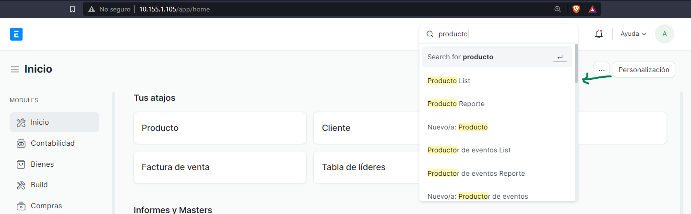
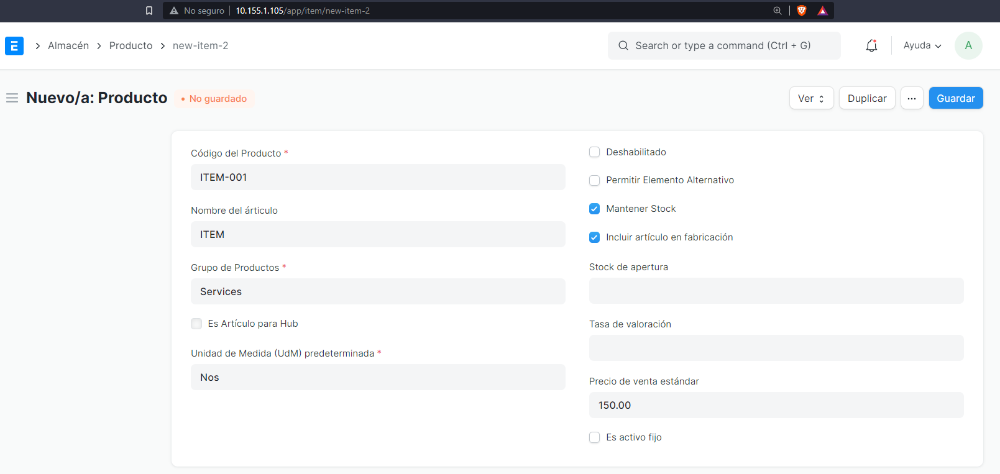

# Configuración de productos

::: tip

Cada producto creado por default se categoriza como servicio (el valor puede cambiarse)

:::

En la ruta `/app/item` o si ingresas en la barra de búsqueda:

## Crear producto

Se recomienda crear el producto en pantalla completa para agregar mas detalles:

Agrega los valores iniciales:

y Guarda. Encontraras mas opciones llena las que mas se adapten a tus necesidades.

::: tip

Se recomienda llenar la tabla de valores default, allí puedes especificar la cuenta de ingreso, gasto, lista de precios predeterminada, etc.

:::

Es importante que marque si el producto es para **compra** o **venta**.

Encontrara una sección llama impuestos especiales, allí puede configurar si un producto lleva un impuesto especial como lo es el IDP, o solo puede especificar si su producto es un bien/servicio/combustible esto es importante para los cálculos y generación de documentos electrónicos.

**Ejemplo para un producto servicio**

